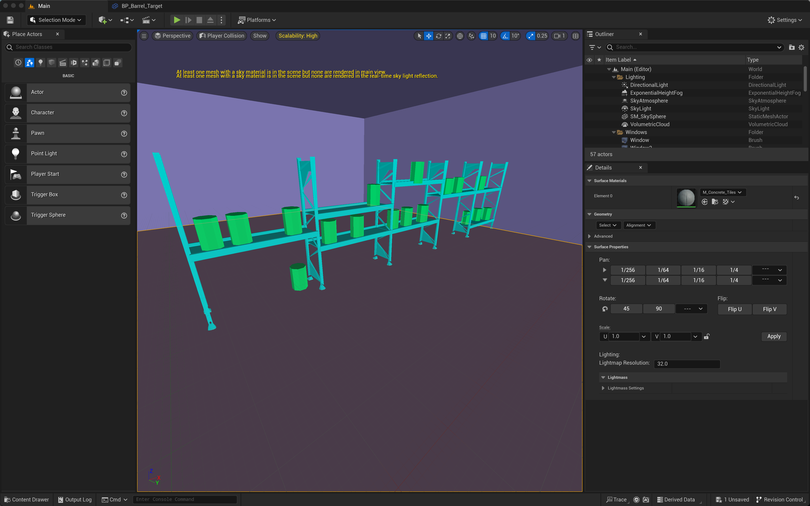
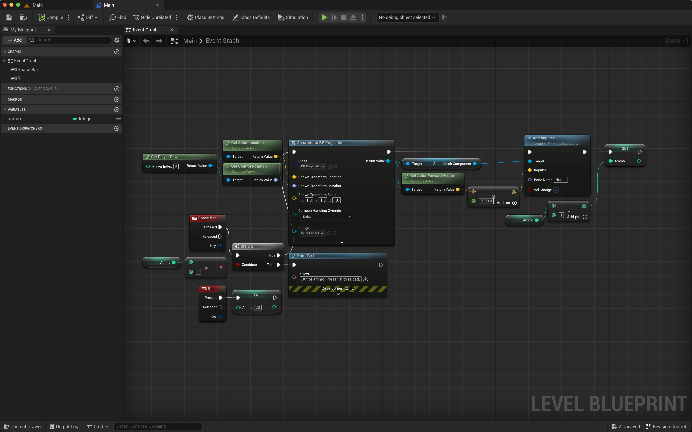

[![Contributors][contributors-shield]][contributors-url]
[![Forks][forks-shield]][forks-url]
[![Stargazers][stars-shield]][stars-url]
[![Issues][issues-shield]][issues-url]
[![MIT License][license-shield]][license-url]
[![LinkedIn][linkedin-shield]][linkedin-url]

    
      
    <h2 align="center">Unreal Engine Playground</h2>
    
This is my playground for learning Unreal Engine

  
Table of Projects

  <ol>
    <li><a href="#playground">Playground</a></li>
  </ol>

 

# Playground

   

My very first Unreal Engine project aka "Playground" 
Super simple warehouse/barrel shooter

## Lessons learned:

- [x] UE Blueprint basics: nodes, pins
- [x] UE physics simulation basics
- [x] UE impulse mechanics
- [x] UE actors, classes, instances, maps, vectors
- [x] UE importing and using assets
- [x] UE variables and functions

[contributors-shield]: https://img.shields.io/github/contributors/FilipsMasolovs/unreal-engine.svg?style=for-the-badge
[forks-shield]: https://img.shields.io/github/forks/FilipsMasolovs/unreal-engine.svg?style=for-the-badge
[stars-shield]: https://img.shields.io/github/stars/FilipsMasolovs/unreal-engine.svg?style=for-the-badge
[issues-shield]: https://img.shields.io/github/issues/FilipsMasolovs/unreal-engine.svg?style=for-the-badge
[license-shield]: https://img.shields.io/github/license/FilipsMasolovs/unreal-engine.svg?style=for-the-badge
[linkedin-shield]: https://img.shields.io/badge/-LinkedIn-black.svg?style=for-the-badge&logo=linkedin&colorB=555

[contributors-url]: https://github.com/FilipsMasolovs/unreal-engine/graphs/contributors
[forks-url]: https://github.com/FilipsMasolovs/unreal-engine/forks
[stars-url]: https://github.com/FilipsMasolovs/unreal-engine/stargazers
[issues-url]: https://github.com/FilipsMasolovs/unreal-engine/issues
[license-url]: https://github.com/FilipsMasolovs/unreal-engine/blob/master/LICENSE.txt
[linkedin-url]: https://www.linkedin.com/in/filips-masolovs